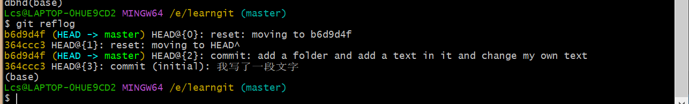

# Lcs 的 Git 基本使用手记（参考的是廖雪峰老师的网站）

### 注意：不要使用记事本（windows）编写文本文件，记得用VS Code

## git安装

这个直接网站指路了

[安装Git - 廖雪峰的官方网站 (liaoxuefeng.com)](https://www.liaoxuefeng.com/wiki/896043488029600/896067074338496)

## 指令笔记

#### git init

初始化仓库

##### git init 文件夹名

这个是表示我们要初始化一个仓库但是我们使用的是自己新建一个文件夹而不是用我们自己正在使用的这个文件夹的文件夹

#### git add 文件名（加类型名，全写）/文件夹名

加入一个文件/文件夹

#### git commit -m "添加自己想添加的注释，可以多行，记得以双引号收尾就好，注意windows是双引号，而Linux是单引号"

提交自己的修改到仓库（确认更新）

### 文件版本更新流程

```git
git add xxx

git commit -m "注释"
```

#### git log

查看当前版本看流程，迭代过程，时间

##### git log --pretty = oneline

简洁化看log迭代流程

#### git reset

时空回溯

##### git reset --hard

###### git reset --hard HEAD^

回溯版本到上衣个版本，这个就是将git当中的指针进行回溯

git内部的机制其实就是去检测现有文件与之前的文件有何区别，然后我们可以去找出这些区别，这就是版本更新的原理。然后会有一张变化表，接着我们相当于要去存这样一张变化表，我们可以惊喜的发现，我们的项目相遇只是存取了“两份”一份是你现在用的这一个部分，而另外一个部分就是你未使用的部分。这样可以极高的提升代码的使用状况，以及内存的存取状态，占用和使用率。

###### git reset --hard 版本序号的前几位

回溯到具体的版本位置

版本号的观看具体图片(红色部分)


#### git diff 文件名

比较文件之前和之后的差异

#### cat 文件名

查看文件内部内容

#### git relog

回溯查看所有操作的版本号




## 工作区

就是你定义的那个程序的操作的文件夹

## 版本库

.git文件夹，用于版本管理的各项事宜
